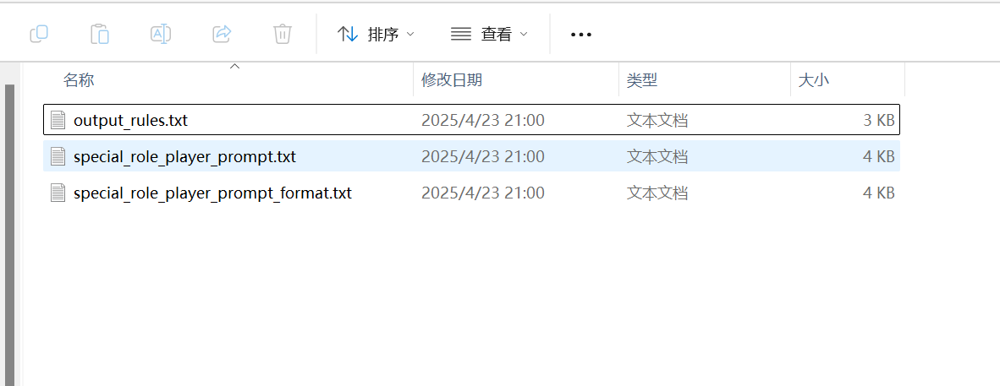

# 开源陪伴型AI测评研究报告

## 1. 研究背景与目的

### 1.1 研究背景
随着人工智能技术的快速发展，陪伴型AI逐渐成为人们生活中的重要组成部分。开源社区涌现出许多高质量的陪伴型AI项目，这些项目在技术实现、用户交互和个性化机制方面各具特色。本研究旨在对三款具有代表性的开源陪伴型AI项目进行探索，分析其特点、实现难点和发展前景。

### 1.2 研究目标
1. 分析不同开源陪伴型AI的技术架构与实现方式
2. 比较各项目的个性化机制和适用场景
3. 探索陪伴型AI的发展趋势和技术挑战
4. 为相关研究与开发提供参考

## 2. 开源陪伴型AI概述

### 2.1 陪伴型AI的定义
陪伴型AI是指能够通过自然语言交互、情感识别和个性化对话，为用户提供心理支持和日常陪伴的人工智能系统。这类AI通常具备以下特点：
- 自然语言交互能力
- 情感识别与情绪响应能力
- 个性化对话与记忆能力
- 多模态交互能力
- 基于深度学习与理解

### 2.2 开源陪伴型AI的发展现状
目前，开源社区涌现出许多高质量的陪伴型AI项目，这些项目在技术实现和功能特点上各有不同。本研究选取以下三款具代表性的项目进行分析：
1. AI Virtual Mate Explorer：全面的多元功能AI框架，支持多模态交互
2. Open-LLM-VTuber：基于大语言模型的语音交互项目，专注自然对话体验
3. ChatBar：基于Pygame的人工智能角色扮演情感陪伴程序

## 3. 项目分析
### 3.1 AI Virtual Mate Explorer

#### 3.1.1 项目概述
AI Virtual Mate Explorer是一款开放度较高的网页版多元AI伴侣框架。该项目以Python作为主要开发语言，使用Flask构建Web服务，Live2D进行角色展示模块，提供全方位的交互体验。

#### 3.1.2 技术架构
通过源代码的分析，AI Virtual Mate Explorer采用模块化设计，主要包含以下核心组件：
- main.py：主程序入口，负责初始化系统和启动各组件
- llm.py：大语言模型模块，支持多种LLM接口
- tts.py：语音合成模块，支持多种TTS服务
- asr.py：语音识别模块，基于SenseVoice等多种ASR服务
- vlm.py：视觉语言模型模块，提供图像识别功能
- chat_web.py：Web交互界面模块
- live2d.py：Live2D角色展示模块
- mmd.py：MMD 3D角色展示模块
- function.py：通用功能函数
- system_init.py：系统初始化模块

该项目支持多种AI服务部署模式：云端API调用、本地端部署，以及边缘计算，实现了配置灵活和多源兼容。

#### 3.1.3 核心技术实现
- 多种模型接口：支持多种云端和本地LLM，如腾讯混元GLM-4-Flash、DeepSeek-R1-7B、通义千问2.5等，使用统一的接口设计，便于扩展。
- 多模态感知：通过OpenCV实现屏幕捕获和摄像头采集，调用VLM模型进行图像理解。
- 长期记忆：支持Letta长期记忆功能，通过持久化存储机制在不同会话间保持状态。
- 实时语音处理：使用SenseVoice实现本地低延迟语音识别，支持中断和热词唤醒功能。
- Web界面：结合flet和flask框架构建轻量级Web界面，支持多设备访问。

#### 3.1.4 个性化机制
AI Virtual Mate Explorer通过以下方式实现个性化：
- 角色设定：用户可以自定义角色名称、性格和背景故事。
- 形象定制：支持自定义Live2D或MMD 3D模型。
- 记忆机制：使用对话历史记录和长期记忆功能，记住用户偏好和关键信息。
- 多模态感知：通过图像识别理解用户环境，提供情境化响应。

#### 3.1.5 对话记忆机制
- 内存存储：使用openai_history列表保存对话历史
- 持久化存储：将对话历史存储在data/db/memory.db文件中，采用JSON格式
- 加载机制：应用启动时从memory.db加载历史对话
- 保存机制：通过json.dump将对话保存到内存和文件
- 清除功能：提供clear_chat和clean_chat_web函数实现历史清除
- 导出功能：支持将聊天记录导出为文本文件

在对话处理中，系统会将完整的对话历史和系统提示一起发送给LLM，实现上下文连贯性：
```
messages = [{"role": "system", "content": tishici}]  # 设置系统提示
messages.extend(openai_history)  # 添加历史对话作为上下文
```

#### 3.1.6 对于用户特征总结，系统设计相对简单：
1. 系统会记录用户名称（默认为"开拓者"），并在对话中始终使用该称呼
2. 未发现明确的用户特征提取和总结机制，系统主要依靠LLM模型本身的上下文理解能力维持对话连贯性和个性化对话

相较于其他项目复杂度，AI Virtual Mate Explorer没有实现高级的用户特征提取、向量存储类似的系统功能，但其简洁设计使其易于理解和使用。系统的核心优势在于直观的界面设计和灵活的角色设定，允许用户轻松定制AI伴侣角色特征。

#### 3.1.7 简介

- 在对话网页上，点击"导出记录"按钮，聊天记录将被保存为txt文本文件。点击"开启新对话"按钮，当前的聊天记录将被清空


- 打开Live2D角色：点击主界面或对话网页上的"2D角色"按钮，将打开Live2D角色展示网页。用户可在网页上通过滑动鼠标或手指实时与虚拟伙伴互动，虚拟伙伴视线持续跟随鼠标或手指，并且支持口型匹配语音输出。
- 打开MMD 3D角色：点击主界面或对话网页上的"3D角色"按钮，将打开MMD 3D角色展示网页，虚拟伙伴嘴部会跟随语音输出动起来。鼠标操作：按住左键调视角；滚动中键调大小；按住右键调位置。触屏操作：单手指调视角；双手指调大小和位置。
- 打开MMD 3D动作：点击主界面的"3D动作"按钮，将打开MMD 3D动作展示网页。用户可前往资源管理便捷更换MMD 3D的vmd动作，以及前往软件设置的更多设置选择、开启或关闭动作mp3背景音乐

### 3.2 Open-LLM-VTuber

#### 3.2.1 项目概述
Open-LLM-VTuber是一款跨平台的语音驱动AI伴侣项目，专注于提供自然流畅的对话和视觉呈现。该项目使用Python构建后端，采用前端Web技术实现界面展示。

项目定位为专注语音交互的AI伴侣，支持实时语音对话、视觉感知、触摸反馈等多项特色功能。配备精美Live2D虚拟形象，特点是可让用户在桌面环境下全程语音交互，跨平台支持，提供了丰富的交互方式和高度的可定制性。用户可以将角色设定为虚拟女友、朋友、教练等多种角色，完全根据个人喜好定制。该项目支持Windows、macOS和Linux系统，提供网页界面和客户端两种使用方式。桌面端客户端特别支持透明背景的桌宠模式，让AI伴侣常驻桌面任意位置陪伴用户。

#### 3.2.2 技术架构
通过源代码的分析，Open-LLM-VTuber采用前后端分离的架构设计：

前端界面：
- Web界面：基于浏览器的用户交互界面
- 桌面客户端：基于Electron的应用程序，支持窗口模式和桌宠模式
- 桌宠模式：特殊显示模式，支持透明背景、全局置顶和鼠标穿透功能


后端核心组件：
- LLM：大语言模型，负责对话生成和内容理解
- ASR：自动语音识别，将用户语音转换为文本
- TTS：文本转语音，将AI回复转换为语音输出
- VAD：语音检测，识别用户语音输入
- Agent：对话代理，管理对话流程和记忆系统
- 其他辅助模块：配置管理、日志系统等

项目采用高度模块化设计，各核心组件（如LLM、ASR、TTS等）可灵活替换和配置，支持多种不同的实现方式和部署选项，使得用户可以根据自己的硬件条件和偏好选择最适合的技术组合。

#### 3.2.3 核心技术实现
- 代理系统：实现了AgentInterface接口，支持多种代理实现，包括基础记忆代理、Mem0长期记忆和HumeAI情感代理。
- 情绪映射：通过Live2D模型的表情映射，将AI的情感状态映射到虚拟形象上。
- 语音交互：集成了多种ASR和TTS组件，支持语音打断功能。
- 透明窗口：支持透明背景、全局置顶和鼠标穿透的AI桌宠，实时陪伴用户。
- 翻译支持：实现了TTS多语言支持，可以使用不同语言进行交流。

#### 3.2.4 支持的模型
LLM（大语言模型）支持：
- 本地部署选项：Ollama、LLama.cpp、LM Studio、vLLM
- 云端API选项：OpenAI、Gemini、Claude、Mistral、DeepSeek、智谱AI等

ASR（语音识别）支持：
- 本地模型：sherpa-onnx、FunASR、Faster-Whisper、Whisper.cpp
- 云端服务：Whisper、Groq Whisper、Azure ASR等

TTS（语音合成）支持：
- 本地模型：sherpa-onnx TTS、pyttsx3、MeloTTS、Coqui-TTS、GPTSoVITS、Bark、CosyVoice
- 云端服务：Edge TTS、Fish Audio、Azure TTS等

#### 3.2.5 个性化机制
Open-LLM-VTuber通过以下方式实现个性化：
- 角色定制：支持多种可定制Live2D模型，可通过提示词定制角色人格
- 表情变化：通过情绪映射表达情感变化和心理状态
- 会话持久化：支持保存和恢复对话历史
- 内部思维展示：允许用户查看AI的内心思考过程，增强互动体验

#### 3.2.6 角色个性定制机制
1. 配置文件中的persona_prompt：
   - 角色个性主要通过配置文件中的persona_prompt字段定义
   - 可以在主配置文件conf.yaml中设置，也可以创建独立的角色配置文件
   - 默认角色"Shizuku"被设定为"尖酸刻薄的女性AI VTuber"，具有"过分自信、尖酸刻薄且危险"的特性


2. 可以导入自定义Live2D模型，让AI伴侣拥有独特外观。通过修改Prompt，塑造AI伴侣的人设。进行音色克隆，让AI伴侣有着用户想要的声线。

3. 多角色支持：
   - 项目支持创建多种角色配置，存放在characters目录下
   - 预设角色包括：
     - zh_米粒.yaml："活泼可爱、勇敢乐观、相信自己强大、喜欢冒险"的中文角色
     - zh_翻译腔.yaml："热情好客、不耐烦、直率灿烂、仔细"的翻译腔角色
     - 以及多个英文角色


4. 表情与内心OS：
   - 通过live2d_expression_prompt增强角色表现力，控制Live2D表情
   - 可选启用think_tag_prompt功能，让AI展示内心想法和动作（不会语音合成）
 
#### 3.2.7 对话记忆机制
基础记忆实现：
1. 对话历史存储：
   - 使用BasicMemoryAgent类维护对话历史
   - 记忆存储在_memory列表中，包含角色、内容和显示信息（名称、头像）
   - 每条消息记录包括角色（用户/AI）、时间戳、内容等信息

2. 聊天历史持久化：
   - chat_history_manager模块将对话保存为JSON文件
   - 历史记录按角色配置ID和历史ID组织存储
   - 用户可以在不同对话历史间切换

3. 用户识别与历史关联：
   - 使用conf_uid标识不同角色配置
   - 使用history_uid标识特定对话历史
   - 通过set_memory_from_history方法加载历史记录


高级记忆支持：
1. 长期记忆潜力：
   - 配置中保留有mem0_agent设置，支持向量数据库存储
   - 使用Qdrant作为向量存储，支持语义搜索
   - 该功能可以为未来实现更高级的长期记忆提供基础

2. 群聊支持：
   - GroupConversationState管理群聊状态和参与者信息
   - 支持为多个AI角色维护各自的记忆状态

#### 3.2.8 提示词系统
Open-LLM-VTuber项目使用模块化的提示词系统，通过prompt_loader.py文件加载和管理不同类型的提示词：

1. 功能性提示词（位于utils目录下）：
   - concise_style_prompt.txt：控制对话风格，使AI回复简洁适度，使用自然语言，避免冗长措辞
   - group_conversation_prompt.txt：设置群聊对话模式，指导AI如何在多人对话中交流
   - live2d_expression_prompt.txt：控制Live2D模型表情，使AI能通过特定关键词表达面部表情和动作
   - think_tag_prompt.txt：让AI使用<think></think>标签表达内心想法和动作描述，增强角色表现力
   
2. 角色设定提示词：
   - 通过配置文件中character_config.persona_prompt字段定义
   - 用户可以自定义角色性格、背景故事的细节

在项目配置中，可以通过system_config.tool_prompts选项控制启用哪些功能性提示词，实现灵活配置。提示词系统支持多语言，有中英文配置可选；同时能自动识别文件的编码格式，便于用户使用。这种模块化设计让用户可以创建并切换不同的角色设定，同时保持基础功能的一致性，非常适合构建对话型AI伴侣。

#### 3.2.9 特色功能
- 视觉感知：支持摄像头、屏幕录制和截图
- 语音打断：无需耳机的语音交互功能
- 触摸反馈：点击或拖拽交互
- 情绪映射：控制Live2D模型表情
- AI内心OS：显示AI不发声的想法和情绪
- TTS翻译：支持多语言交互，如中文输入日语输出
- 宠物模式：透明背景全局置顶的桌面宠物
- AI主动说话：AI可以自主发起对话
- 聊天记录持久化：保存并可切换历史对话
- 群聊功能：支持多角色互动对话

### 3.3 ChatBar

#### 3.3.1 项目概述
ChatBar是一款基于游戏化交互设计的开源陪伴型AI项目，以Pygame为主要界面框架，提供图形交互和角色互动功能，注重沉浸式的交互体验。

#### 3.3.2 技术实现
通过源代码的分析得到：
- 对话管理：集成在主类中，处理与LLM的交互
- 语音识别和合成：通过speech_recognition.py和get_voice.py实现
- 知识库查询：通过init_db()方法初始化多种知识库
- 网络搜索：通过web_search()方法实现
- 角色状态管理：通过多个方法和属性管理角色的图像、关系等状态

项目使用Electron构建用户界面，通过各种API调用实现AI交互、语音合成、语音识别，使用现代前端框架处理交互。

#### 3.3.3 核心技术实现
- 角色情感系统：实现了复杂的角色状态系统，包括好感度和信任值等参数。
- 情绪变化：根据对话内容动态调整角色情绪和关系状态。
- API整合：支持多种主流API调用，提高兼容性和多样化，包括百度、通义千问、DeepSeek等。
- 知识库增强：实现了本地知识库增强功能，增强AI回答准确度。
- 图像切换：通过角色图像切换表达不同情绪状态。

#### 3.3.4 个性化机制
ChatBar通过以下方式实现个性化：
- 角色关系系统：通过好感度、信任值等参数模拟真实关系发展
- 情绪变化：根据对话内容动态调整角色情绪状态
- 日程安排：实现角色的日常行为模拟，增强真实感
- 多模态反馈：通过文本和图像变化表达角色情绪变化

#### 3.3.5 角色个性设定方式
1. 详细的角色配置文件：
   - ChatBar使用独立的角色配置文件，存放在role_cards/[角色名称]/目录下
   - 每个角色包含专门的prompt文件，包含以下关键文件：
     - special_role_player_prompt.txt：详细角色设定，包括性格、背景、能力特点、说话方式等
     - output_rules.txt：控制角色回复的规则，包括情绪表达方式等规范



2. 多维度的角色描述：
   - 角色设定非常详细，比Open-LLM-VTuber的persona_prompt更全面
   - 包括角色血型、年龄、饮食习惯、家庭背景、说话习惯等多维度信息
   - 提供丰富的情境描写，如"阳光透过树叶洒落在地上"等氛围描绘

3. 情绪关系系统：
   - 特色的情感反馈机制，使用0、+、!+、!!+、-、!-、!!-、~、!~、!!~等标记表示情绪变化
   - 实现了复杂的情感关系变化系统，通过relationship_index跟踪关系（从0-6级的亲密程度）
   - 使用favorability（好感度）和trust_value（信任度）等指标动态调整角色对用户的态度

#### 3.3.6 对话记忆机制
对话内容存储方式：
1. 短期记忆存储：
   - 内存缓存：当前对话会话存储在conversation_history列表中
2. 会话持久化：
   - 应用关闭时，保存完整会话

#### 3.3.7 用户特征总结
1. 关系模型构建：
   - ChatBar通过维护用户与角色的关系状态，根据交互内容动态调整关系状态，从陌生人可以发展到亲密关系，关系变化是渐进式的，需要累积足够的好感度才能提升关系等级

2. 情感反馈系统：
   - 通过update_relationship函数动态调整好感度和信任度
   - 不同情绪标记对应不同程度的好感度变化，如"!!+"表示大幅度提升好感度
   - 当好感度达到100时，关系等级会自动提升

## 4. 功能对比分析

### 4.1 架构对比
表1：项目架构对比

| 特性 | AI Virtual Mate Explorer | Open-LLM-VTuber | ChatBar |
|------|-------------------------|-----------------|---------|
| 整体架构 | 模块化Web服务(Flask+Flet) | 前后端分离架构设计 | 单应用 |
| 主要语言 | Python | Python+JS | TypeScript |
| 角色展示 | Live2D/MMD 3D | Live2D | 图像切换 |
| 开发复杂度 | 中等 | 较高 | 较低 |


### 4.2 实现对比

| 实现 | AI Virtual Mate Explorer | Open-LLM-VTuber | ChatBar |
|------|-------------------------|-----------------|---------|
| 语音处理 | 实时语音使用 | 实时语音使用，语音处理与延迟与打断处理 | 实时语音使用 |
| 记忆系统 | 将对话历史存储在data/db/memory.db文件中，采用JSON格式 | chat_history_manager模块将对话保存为JSON文件 | 重要对话保存到JSON文件中 |
| 部署挑战 | 中等 | 难 | 简易 |


### 4.3 个性化机制对比

三个项目在个性化机制设计上各有特点：

1. 角色定制方面：
   - AI Virtual Mate Explorer：通过config.json文件定义角色性格，支持简单的角色设定更改
   - Open-LLM-VTuber：使用YAML格式的角色配置文件，支持多角色切换，并通过表情映射增强表现力
   - ChatBar：提供详细的角色设定系统，包含多维度信息描述和情感反馈机制

2. 记忆机制方面：
   - AI Virtual Mate Explorer：使用JSON格式和db数据库对话历史存储无复杂的记忆检索。
   - Open-LLM-VTuber：支持对话历史持久化和切换，具备向量数据库支持的潜力
   - ChatBar：实现了对话历史的记录和导出

3. 用户模型构建：
   - AI Virtual Mate Explorer：依赖LLM的上下文理解，无专门的用户建模
   - Open-LLM-VTuber：基础的对话历史保持，无专门的用户特征提取
   - ChatBar：通过关系值和状态跟踪，构建动态发展的用户-角色关系模型

总体而言，ChatBar在个性化和关系模拟方面提供了最深度的实现，Open-LLM-VTuber在多模态交互和跨平台支持方面表现突出，而AI Virtual Mate Explorer则在模块化设计和扩展性方面具有优势。

## 5. 优势与劣势

### 5.1 AI Virtual Mate Explorer
#### 5.1.1 优势
- 架构设计较清晰，模块化设计和多模式部署支持使适应性强
- 多模态交互，支持视觉输入与文本多模态交互
- 扩展性高，提供丰富的API接口和配置选项
- 跨平台支持，基于Web界面可以在多种设备上访问
- 形象定制强，同时支持Live2D和MMD 3D模型展示

### 5.2 Open-LLM-VTuber
#### 5.2.1 优势
- 应用场景丰富：支持Web、客户端和桌宠等多种交互模式
- 跨平台支持好：完全支持Windows、macOS和Linux
- 用户体验出色：透明桌宠模式具有很高的沉浸感
- 扩展性强：良好的接口设计便于扩展不同的AI实现
- 持续更新：活跃的更新和改进

### 5.3 ChatBar
#### 5.3.1 优势
- 资源消耗较低：系统资源需求较低
- 情感模型独特：精心设计的角色关系和情绪变化系统
- 界面美观：Galgame风格的界面直观易用
- 安装便捷：部署和配置相对简单
- 角色反馈生动：强调角色人格和关系发展

## 6. 发展趋势与建议

### 6.1 发展趋势
1. 模型本地化与隐私保护：本地运行模型将成为减少延迟和提升隐私的重要方向
2. 多模态融合：视觉输入与文本、语音的融合将产生更加自然的交互体验
3. 情感理解增强：细致的情绪识别和表达将成为关键竞争力
4. 个性化深度：针对用户长期记忆和定制将使AI伴侣的行为更贴合用户
5. 长期记忆优化：从简单存储选取到多层级记忆平衡将是长期挑战

### 6.2 发展建议
1. 注重隐私增强：增强个性设定的同时，保护用户数据不被外传
2. 模块化设计：配置部件能够更好地适应功能扩展和技术迭代
3. 标准化接口：设计统一的LLM、TTS、ASR接口，便于替换组件
4. 轻量模型探索：尝试更小但专业化的模型，减轻硬件实现
5. 部署程序简化：简化安装配置流程，扩大用户群体

## 7. 结论

通过对三款开源陪伴型AI项目源代码的深入分析，我们可以看出：
1. AI Virtual Mate Explorer在技术架构和多模态方面表现更为全面，适合需要丰富功能的场景
2. Open-LLM-VTuber在用户体验和跨平台支持方面表现突出，特别适合桌面陪伴场景
3. ChatBar在情感模型和角色塑造方面更加出色，适合追求情感连接的用户

这三个项目各有不同，也映射了开源陪伴型AI的不同发展方向。未来陪伴型AI将更注重用户体验、隐私保护与情感理解，同时通过技术迭代使轻量级设备也能运行高质量、高度定制的陪伴型AI。用户可根据自身需求，选择适合的开源应用进行定制，共同推动开源社区的发展与创新。

## 参考文献
1. AI Virtual Mate Explorer项目文档[EB/OL]. https://github.com/swordswind/ai_virtual_mate_web, 2024.
2. Open-LLM-VTuber项目文档[EB/OL]. https://github.com/t41372/Open-LLM-VTuber, 2024.
3. ChatBar项目文档[EB/OL]. https://github.com/JinXiaofeng1234/ChatBar, 2024.